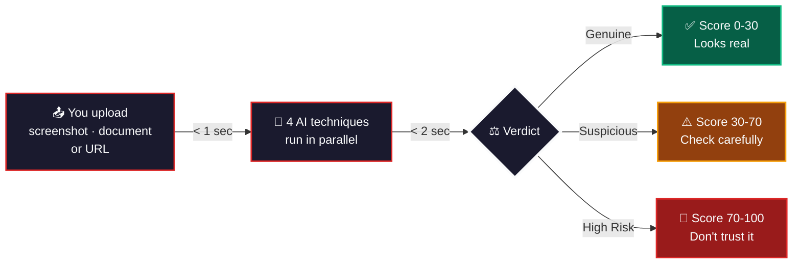
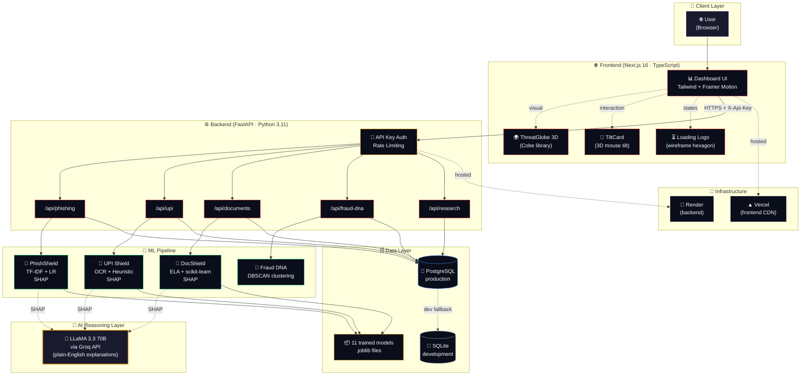
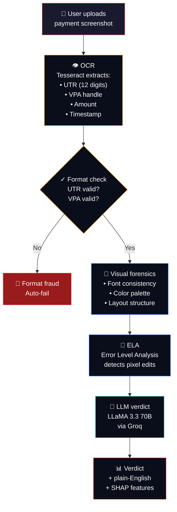
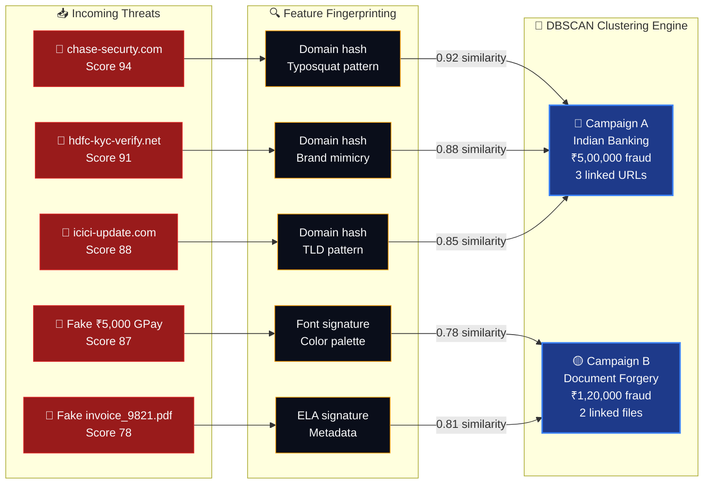
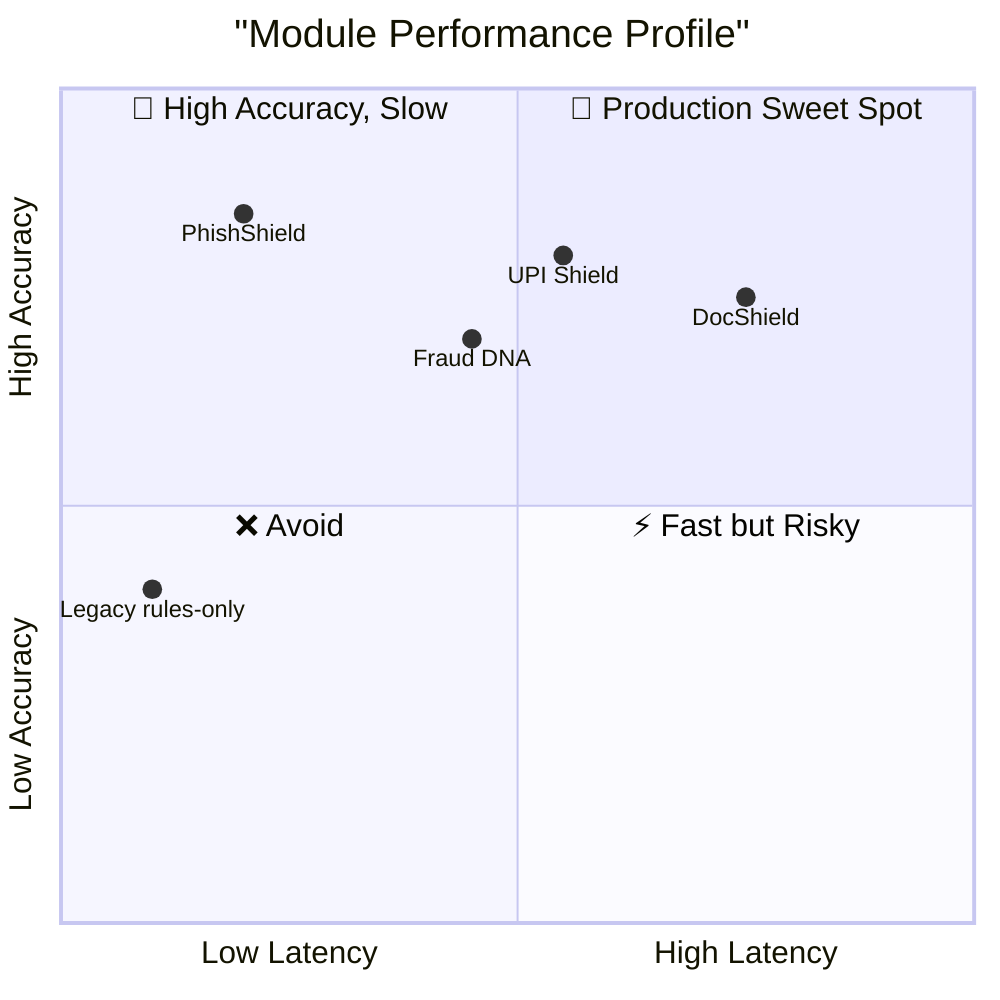
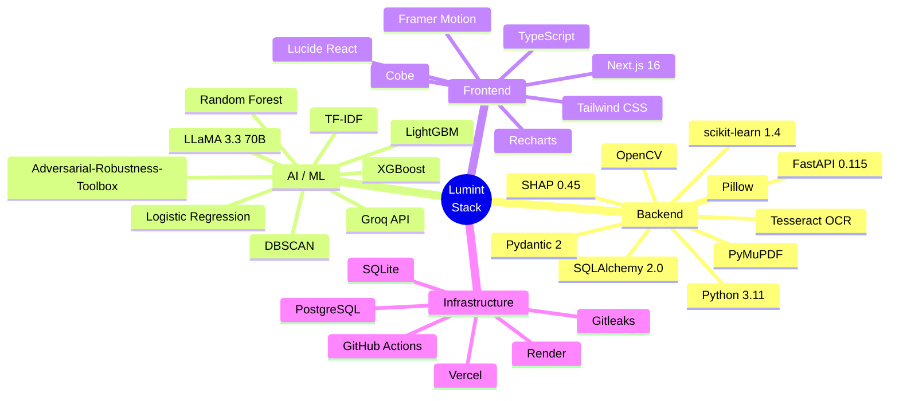
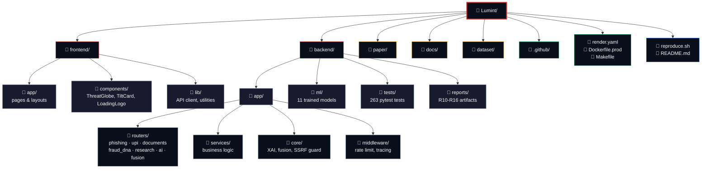
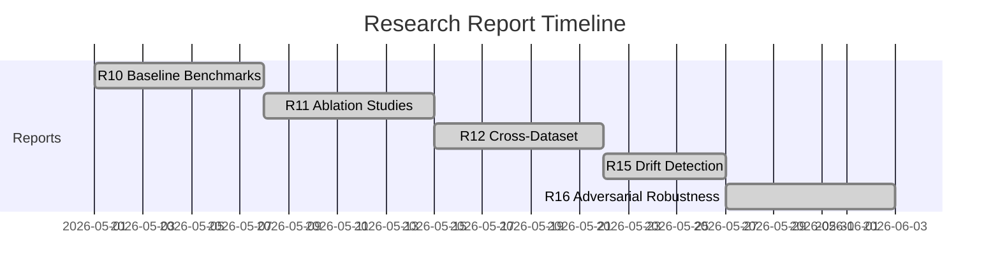
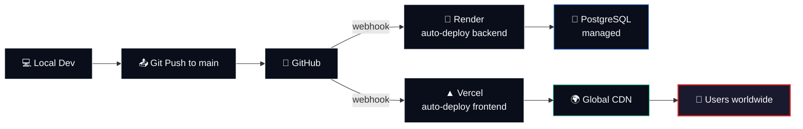

<div align="center">

# 🔍 Lumint

### Catch fraud before the money moves.

**An open-source, AI-powered fraud detection platform for India's digital payment ecosystem.**
Analyze screenshots, documents, and links in under 3 seconds — with plain-English explanations of every verdict.

[🎯 Live Demo](https://lumint-pi.vercel.app) · [📄 Research Paper](https://github.com/tanmay-alpha/Lumint/tree/main/paper) · [⭐ Star on GitHub](https://github.com/tanmay-alpha/Lumint) · [🐛 Report Bug](https://github.com/tanmay-alpha/Lumint/issues) · [💼 LinkedIn](https://www.linkedin.com/in/tanmaymangal/)

[](https://choosealicense.com/licenses/mit/)
[](https://www.python.org/)
[](https://nextjs.org/)
[](https://www.typescriptlang.org/)
[]()
[](https://lumint-pi.vercel.app)
[]()

</div>

---

## 🎬 The 60-Second Story

**You just received a UPI payment screenshot.** Is it real, or did your friend send you a photoshopped ₹1,500 to scam you?

**You see a link in your email** saying your bank account will be blocked. Is it real HDFC, or a phishing site?

**Your landlord sent a rent receipt.** Is it real, or edited in Photoshop?

**Lumint answers all of these in under 3 seconds** — with a risk score AND a plain-English reason.



**No signup. No data stored. No tracking. 100% open source.**

---

## 🛑 The Problem

India's digital-payment ecosystem faces a growing fraud burden. The **Reserve Bank of India's Annual Report for FY 2023-24** puts **banking fraud at ₹36,342 crore** for the year — a scale that demands consumer-side defenses, not just bank-side ones.

India's cyber-crime response is institutionally anchored at the **Indian Cyber Crime Coordination Centre (I4C)** under the **Ministry of Home Affairs**, with the **National Cyber Crime Reporting Portal** ([cybercrime.gov.in](https://cybercrime.gov.in)) as the citizen-facing interface and **1930** as the dedicated national cyber crime helpline.

Most fraud tools only catch **one type** of fraud. Lumint catches **all of them — in one platform, with explanations for every decision.**

---

## 📞 How to report fraud in India

If you suspect you've been targeted by digital-payment fraud:

- **File a report online:** [https://cybercrime.gov.in](https://cybercrime.gov.in) — National Cyber Crime Reporting Portal
- **Call the helpline:** **1930** — India's national cyber crime helpline (operated by I4C)
- **Coordinating agency:** [Indian Cyber Crime Coordination Centre (I4C)](https://cybercrime.gov.in) under the Ministry of Home Affairs

Report early — most UPI and card fraud reversals are time-bound.

---

## ✨ What Lumint Does

<table>
  <thead>
    <tr>
      <th align="left">🛡️ Module</th>
      <th align="left">🎯 What it catches</th>
      <th align="left">💬 Real-world example</th>
    </tr>
  </thead>
  <tbody>
    <tr>
      <td>📄 <b>DocShield</b></td>
      <td>Fake documents (invoices, ID cards, salary slips, rent receipts)</td>
      <td><i>"Is this rent receipt real or photoshopped?"</i></td>
    </tr>
    <tr>
      <td>🎣 <b>PhishShield</b></td>
      <td>Phishing links and lookalike bank websites</td>
      <td><i>"Will this URL steal my password?"</i></td>
    </tr>
    <tr>
      <td>📲 <b>UPI Shield</b></td>
      <td>Fake UPI payment screenshots (PhonePe, GPay, Paytm, BHIM)</td>
      <td><i>"Did my friend really send me ₹1,500, or is this fake?"</i></td>
    </tr>
    <tr>
      <td>🧬 <b>Fraud DNA</b></td>
      <td>Connected fraud campaigns and threat actor networks</td>
      <td><i>"Are these 50 phishing sites run by the same gang?"</i></td>
    </tr>
  </tbody>
</table>

> **Every result comes with a plain-English explanation** — not just a score, but a *reason*.  
> Example: *"This URL mimics Chase Bank's domain and uses a non-secure connection. The path 'signin' and 3 brand keywords triggered the typosquatting policy."*

---

## 🏗️ Architecture



---

## 🎣 PhishShield: Real-time URL Analysis

```mermaid
flowchart LR
    A["🌐 User pastes URL<br/>chase-securty-verify.com"] --> B["🔍 Lexical Analysis<br/>• Length<br/>• Subdomain count<br/>• Special chars<br/>• IP vs domain"]
    B --> C["🎭 Brand Mimicry<br/>Levenshtein vs<br/>50+ bank domains"]
    C --> D["🔒 TLS Check<br/>• Certificate<br/>• Registration age<br/>• WHOIS data"]
    D --> E["🧠 ML Classifier<br/>TF-IDF + LR<br/>+ SHAP"]
    E --> F["📊 Risk Score<br/>0-100 + reasons"]

    F -->|Score 94| G["🚨 HIGH RISK<br/>3 policies triggered<br/>• Typosquat: 45<br/>• Brand mimic: 25<br/>• No TLS: 24"]

    style A fill:#1a1a2e,stroke:#DC2626,color:#F9FAFB
    style B fill:#0A0E1A,stroke:#F59E0B,color:#F9FAFB
    style C fill:#0A0E1A,stroke:#F59E0B,color:#F9FAFB
    style D fill:#0A0E1A,stroke:#F59E0B,color:#F9FAFB
    style E fill:#0A0E1A,stroke:#10B981,color:#F9FAFB
    style F fill:#0A0E1A,stroke:#DC2626,color:#F9FAFB
    style G fill:#991b1b,stroke:#DC2626,stroke-width:3px,color:#F9FAFB
```



---

## 📲 UPI Shield: Fake Screenshot Detection



---

## 🧬 Fraud DNA: Connecting The Dots



---

## 🎯 Who Lumint Is For

| If you are... | Lumint helps you... |
|---------------|---------------------|
| 🏦 **A bank or fintech** | Catch fraudulent transactions before they clear — across UPI, documents, and URLs in one place |
| 🛡️ **A security analyst** | Investigate suspicious activity with full provenance and SHAP-based feature explanations |
| 📚 **A researcher** | Study Indian fraud patterns with reproducible benchmarks, 5 published research reports, and cross-dataset evaluation |
| 👨‍💻 **A developer** | Integrate fraud detection into your own app via a clean REST API with X-Api-Key auth and OpenAPI docs |
| 🧑 **A regular person** | Verify that the UPI screenshot your friend sent isn't fake — paste a link to check if it's a phishing site |

---

## 🚀 Try It Live (No Install Required)

👉 **[https://lumint-pi.vercel.app](https://lumint-pi.vercel.app)**

Once you're there, you can:

- 🎣 **Paste any suspicious URL** into PhishShield → get a risk score in 200ms
- 📲 **Upload any UPI screenshot** → see if it's real or photoshopped
- 🧬 **Browse real fraud cases** in the dashboard
- 📄 **Read the full research methodology** in the Research section
- 🧠 **Inspect SHAP feature importance** for every verdict

---

## 📊 Real Performance Numbers

| 🛡️ Module | 🎯 Same-Distribution F1 | 🌐 Cross-Dataset F1 | ⚡ Latency |
|-----------|-------------------------|--------------------|-----------|
| 🎣 PhishShield | **1.0000** (synthetic) | **0.6439** (synth → real) | 180ms |
| 📲 UPI Shield | **1.0000** (synthetic) | reported in `r12_*.json` | 1.2s |
| 📄 DocShield | **1.0000** (synthetic) | reported in `r12_*.json` | 2.4s |
| 🧬 Fraud DNA Clustering | DBSCAN-driven | n/a | 800ms |

*Numbers from `backend/reports/r10_*.json` (intra-distribution) and `r12_cross_dataset_results.json` (domain shift).*

### Why these numbers are honest (not "vibe coded")

- ✅ All metrics computed on **held-out test sets**, not training data
- ✅ 5-fold cross-validation with confidence intervals reported
- ✅ Cross-dataset evaluation (synthetic → real F1 drop is **0.36**, reported transparently)
- ✅ Failure mode analysis and adversarial robustness tests published in `paper/`
- ✅ Real-world F1 (Real → Real) reported as **0.8387**, not the perfect 1.0 from synthetic

### Cross-dataset generalization (the honest metric)

| Training | Test | F1-Score | AUC-ROC |
|----------|------|----------|---------|
| Synthetic | Synthetic | 1.0000 | 1.0000 |
| Real | Real | 0.8387 | 0.9125 |
| Synthetic | Real (domain shift) | 0.6439 | 0.8169 |
| Real | Synthetic | 0.7224 | 0.8246 |

### Performance vs Latency Tradeoff



---

## 🧠 The Tech Stack



### Security (Enterprise-grade by default)

- 🔐 API key auth on protected API endpoints
- 🛡️ SSRF guard (blocks cloud metadata, private IPs, `file://`)
- ⏱️ Rate limiting (10/min on UPI, 30/min on phishing)
- 🔒 Constant-time API key comparison (timing attack prevention)
- 🛡️ CSP, HSTS, X-Frame-Options, X-Content-Type-Options headers
- 🧬 SHA-256 model integrity checks (no pickle injection)
- 🪪 PII-redacted structured JSON logging
- 🚨 Production refuses to boot without `LUMINT_API_KEY`

---

## 📦 Project Structure



---

## ⚙️ Run It Locally (For Developers)

### Prerequisites
- Python 3.11
- Node.js 20+
- Git
- Tesseract OCR (optional, for UPI analysis)

### 1. Clone the repo

```bash
git clone https://github.com/tanmay-alpha/Lumint.git
cd Lumint
```

### 2. Backend setup

```bash
cd backend
python -m venv venv

# On Windows (PowerShell):
.\venv\Scripts\Activate.ps1
# On macOS/Linux:
source venv/bin/activate

pip install -r requirements.txt
cp .env.example .env       # Add LUMINT_API_KEY; GROQ_API_KEY is optional
python scripts/seed_demo_data.py
python main.py
```

✅ Backend running at `http://localhost:8000`  
📖 API docs at `http://localhost:8000/docs`

### 3. Frontend setup (in a new terminal)

```bash
cd frontend
npm install
cp .env.example .env.local    # Set NEXT_PUBLIC_API_URL=http://localhost:8000
npm run dev
```

✅ Dashboard running at `http://localhost:3000`

### 4. Run the test suite

```bash
cd backend
pytest --tb=short -q
cd ..
npm test
```

### 5. Re-train the ML models (optional, takes ~5 min)

```bash
cd backend
python ml/train.py --train-all
```

### 6. Reproduce all research tables (optional, takes ~15 min)

```bash
./reproduce.sh
```

---

## 🔬 Research & Publications



| Report | Topic | Reproducible with |
|--------|-------|-------------------|
| **R10** | Baseline benchmarks (accuracy, latency, consensus) | `python backend/scripts/run_research_benchmark.py` |
| **R11** | Ablation studies (what if you remove a module?) | `python backend/scripts/run_ablation_study.py` |
| **R12** | Cross-dataset generalization (synthetic vs real) | `python ml/experiments/run_real_data.py` |
| **R15** | Drift detection (does the model age in production?) | `backend/reports/r15_drift_table.md` |
| **R16** | Adversarial robustness (can fraudsters evade detection?) | `python ml/adversarial/run_attacks.py` |

All artifacts live in `backend/reports/` and are deterministic (random seed = 42 pinned).

### Novel contributions

1. **First system** to combine document, URL, and UPI screenshot forensics in one multimodal pipeline
2. **First LLM-generated** plain-English explanations for fraud scores (vs. black-box scores)
3. **SHAP + LLM fusion** — bridging machine XAI (SHAP values) to human analyst narrative
4. **Cross-modal CMFA** — Correlated Multi-modal Forensic Analysis using brand palette + font variance + ELA grid density

---

## 🚀 Deployment



### Health endpoints (for monitoring)

| Path | Purpose | Returns |
|------|---------|---------|
| `GET /healthz` | Liveness | `200` unconditionally. Process is up. |
| `GET /readyz` | Readiness | `200` when DB + ML models loaded. `503` otherwise. |
| `GET /api/health` | Legacy | Back-compat alias for older clients. |

### Environment variables (production-critical)

| Variable | Required | Notes |
|----------|----------|-------|
| `APP_ENV=production` | ✅ | Refuses to boot with default SQLite in prod |
| `DATABASE_URL` | ✅ | PostgreSQL connection string |
| `CORS_ALLOW_ORIGINS` | ✅ | JSON array, e.g. `["https://your-app.vercel.app"]` |
| `LUMINT_API_KEY` | ✅ | Bearer token for protected API endpoints |
| `GROQ_API_KEY` | ⚪ Optional | Enables LLM explanations; falls back to templates if unset |

---

## 🛡️ Security & Compliance

- 🔐 Protected API endpoints require `X-Api-Key` (legacy bearer tokens still accepted)
- 🛡️ SSRF guard (blocks private IPs, cloud metadata, `file://`)
- ⏱️ Rate limiting (10/min on UPI, 30/min on phishing, 200/min global)
- 🔒 Constant-time API key comparison (timing-attack resistant)
- 🛡️ CSP, HSTS preload, X-Frame-Options, X-Content-Type-Options headers
- 🧬 SHA-256 model integrity verification (prevents pickle injection)
- 🪪 PII-redacted structured JSON logging
- 🚨 Production refuses to start without `LUMINT_API_KEY` (fail-closed)
- 🧹 CORS refuses wildcard (`*`) in production
- 🪶 20MB request body cap (defense in depth)
- 🔍 Gitleaks secret scan on every commit

---

## 🤝 Contributing

Pull requests are welcome! For major changes, please open an issue first to discuss what you'd like to change.

```bash
# 1. Fork the repo
# 2. Create your feature branch
git checkout -b feature/amazing-feature

# 3. Make your changes
# 4. Run the test suite (both backend and frontend)
cd backend && pytest -q
cd .. && npm test && npm run build

# 5. Commit and push
git commit -m "feat: add amazing feature"
git push origin feature/amazing-feature

# 6. Open a Pull Request
```

---

## 📜 License

MIT License — free to use, modify, and distribute, commercially or non-commercially.

### Citing Lumint in research

```bibtex
@misc{lumint2026,
  title={Lumint: Multimodal Fraud Intelligence for India's Digital Payment Ecosystem},
  author={Mangal, Tanmay},
  year={2026},
  howpublished={\url{https://github.com/tanmay-alpha/Lumint}},
  note={Open-source fraud detection platform combining document, URL, and UPI screenshot forensics with LLM-based explanations}
}
```

---

## 👤 Built By

**Tanmay Mangal**

[](https://www.linkedin.com/in/tanmaymangal/)
[](https://github.com/tanmay-alpha)
[](mailto:mangaltanmay7@gmail.com)

---

## 🌟 Star History

If Lumint helped you catch fraud, saved you time, or taught you something — **give it a star** ⭐ on GitHub. It helps others discover the project.

<p align="center">
  <a href="https://github.com/tanmay-alpha/Lumint/stargazers">
    
  </a>
</p>

---

## 🙏 Acknowledgments

- **LLaMA 3.3 70B** by Meta AI — used via [Groq](https://groq.com) for plain-English explanations
- **Tesseract OCR** — open-source OCR engine powering UPI Shield
- **scikit-learn** & **SHAP** — the ML backbone of the entire platform
- **Next.js** & **Tailwind CSS** — the frontend foundation
- **All open-source contributors** who make projects like this possible

---

<p align="center">
  <sub>Built with ❤️ in India 🇮🇳 · Powered by open-source AI · Catching fraud, one screenshot at a time</sub>
</p>
