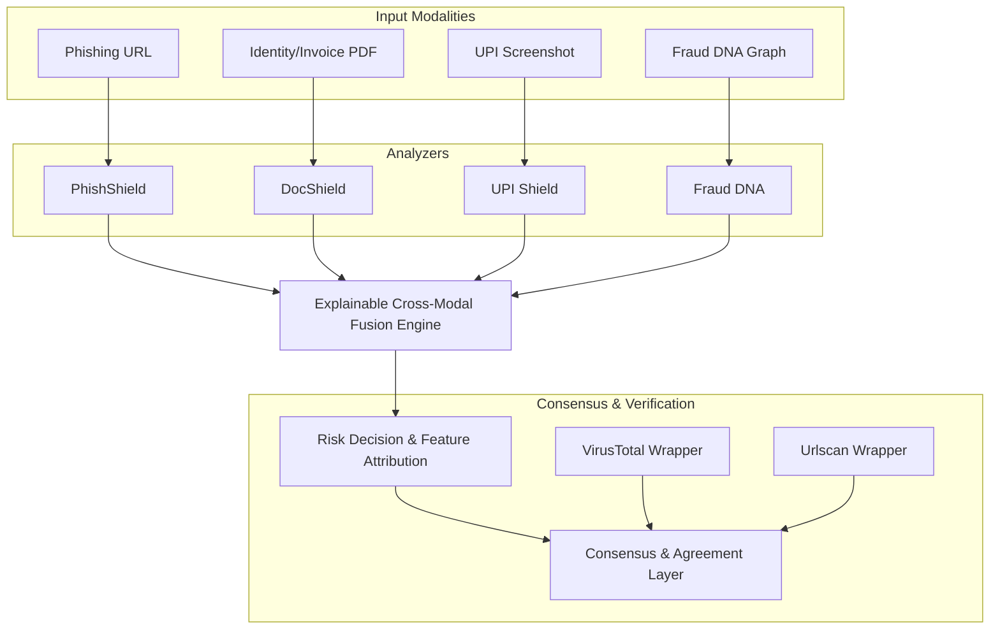

# System Architecture

## Modular Analysis Engines

### 1. DocShield
Performs metadata sanitization, structural analysis, and OCR forgery scanning on PDF/Image documents.

### 2. PhishShield
Scans incoming URLs for high-risk domains, IP addresses, subdomains, and matches against known threat lists.

### 3. UPI Shield
Analyzes transaction screenshots:
- UTR validation and format checking.
- Error Level Analysis (ELA) for image compression inconsistencies.
- Font family and size variance checks.
- App shell signature recognition.

### 4. Fraud DNA
Maintains a contextual relationship database linking shared components (URLs, emails, phone numbers) across past fraud cases.
